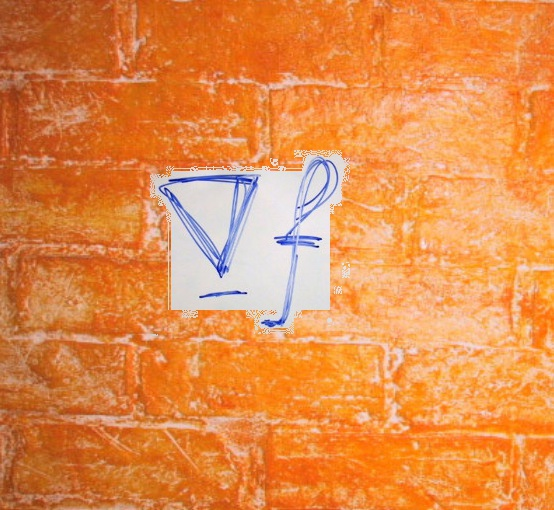
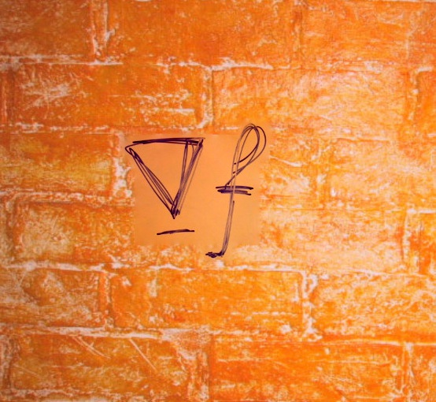
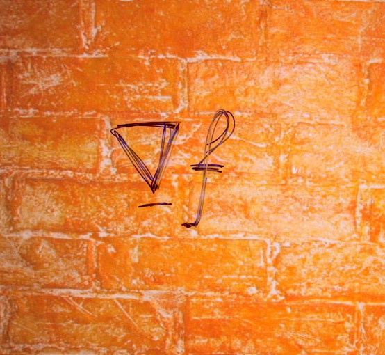
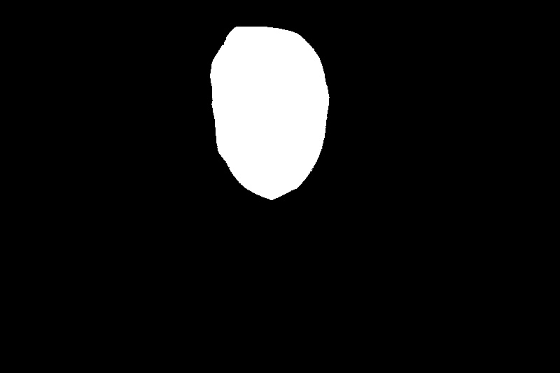
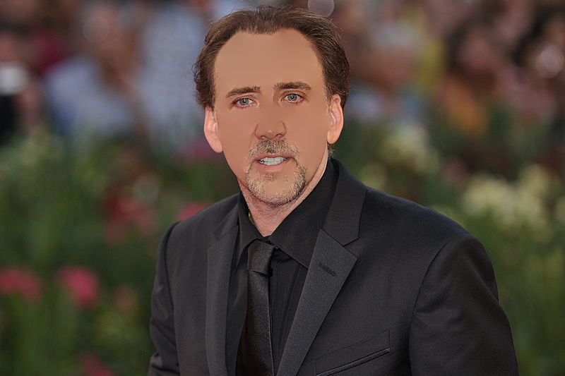
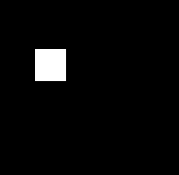
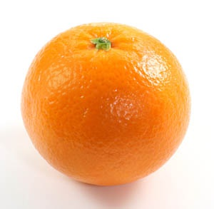

# 实验报告

计52 沈俊贤 2015011258

## 背景

论文：《Poisson Image Editing》

本人实现代码github仓库：https://github.com/datawine/poisson_image_editing

作为一种图像融合算法，Poisson Image Editing通过基于解决泊松方程的经典的插值算法，构建了两类创新的工具，一类工具可以用来进行图片之间的图像融合，另一类工具可以用来在同一张图片中选定区域进行相应操作。

## 算法原理

设$\Omega​$是从A图中拷贝出来的一部分，我们需要将$\Omega ​$粘贴到B图上的某个部位，$\partial \Omega​$是其边界，S区域属于B图。为了从视觉上消除边界，可以固定$\partial \Omega​$上的颜色等于B图中的颜色，而$\Omega​$内部的颜色梯度保持与A图一致。

可以用数学公式表示：

$min_f \iint_\Omega |\bigtriangledown f - \bigtriangledown g|^2, \ f|_{\partial \Omega}=f^*|_{\partial \Omega}​$

其中$\bigtriangledown=[\frac{\partial .}{\partial x}, \frac{\partial .}{\partial y}]$为梯度运算符。

上述方程就是一个带狄利克雷边界条件的泊松方程。

### 具体应用

#### 普通的泊松融合

最普通的泊松融合就是通过解决上面的方程，让拷贝出来的patch的边界的像素值为目标图片的像素值，从而解这个泊松方程。

#### 混合梯度的泊松融合

如果我们的目标图片有比较明显的纹理，那么我们需要在解方程的时候考虑到这一点。这时我们可以修改方程为：

$min_f \iint_\Omega |\bigtriangledown f - v|^2, \ f|_{\partial \Omega}=f^*|_{\partial \Omega}​$

其中$v=max（\bigtriangledown f^*, \bigtriangledown g）$。简单地说，就是在图像的重叠部分，选取更大的梯度。

#### 局部磨平纹理

局部磨平纹理的操作是在一张图片上进行的。同样也是修改相应的梯度部分，在检测到的边缘附近保留原来的梯度，在其他地方选择将梯度变为0，即修改方程为：

$min_f \iint_\Omega |\bigtriangledown f - v|^2, \ f|_{\partial \Omega}=f^*|_{\partial \Omega}​$

其中$v=f_p^*-f_q^*,if \ q和p之间存在明显的边,else\ 0$

#### 局部亮度调整

局部亮度调整同样也是在一张图片上进行的。我们需要对选取的对应区域进行亮度的平均，即加强不明显的梯度变化，抑制明显的梯度变化。由论文中的经验公式，可以修改方程为：

$min_f \iint_\Omega |\bigtriangledown f - v|^2, \ f|_{\partial \Omega}=f^*|_{\partial \Omega}$

其中$v=\alpha ^\beta |\bigtriangledown f^*|^{-\beta}\bigtriangledown f^*$，其中$\alpha$是$\Omega $区域内的平均梯度的`0.2`倍，$\beta=0.2$。

## 实现细节及结果

### 项目代码解释

- main.py
  - 主函数入口
- poisson.py
  - 包含Poisson类，进行泊松融合的相关操作
- postprocessing.py
  - 后处理，即生成处理后的图片
- preprocessing.py
  - 预处理，即生成处理所需要的数据
- myMathFunc.py
  - 一些数学函数，用来解泊松方程

### 结果

#### 普通的泊松融合

源图片和mask：

背景图片：

直接混合的图片：

经过泊松融合的图片：

#### 混合梯度的泊松融合

源图片：

mask：

背景图片：

直接融合的图片：

经过泊松融合的图片：

经过泊松混合梯度融合的图片：

#### 局部磨平纹理

源图片：

mask：

结果：

#### 局部亮度调整

源图片：

mask：

结果：

## 优缺点及改进方向

### 优点

- 对于大部分图像来说，泊松融合的效果很好
- 速度较快，只需要求解一个稀疏方程
- 自由度高，能够对方程进行各种变化，满足不同的需求

### 缺点

- 算子单一，目前采用的是梯度的方法进行计算，在一些梯度较大的需要剔除的部分（如草地等）可能无法识别
- 方程如果不够精确，容易产生三角面片

### 改进方法

- 引入显著性区域检测等手段，将背景与目标分开

## 实验感想

泊松图像融合作为一种非常成功的图像融合算法，拥有非常好的实用性和普遍性，在完成的过程中也发现泊松图像融合的应用非常广泛，不限于“融合”，对单张图像的操作也有非常多能够探索的空间。

